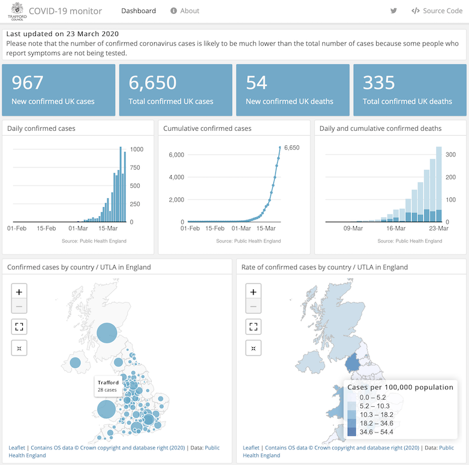

# COVID-19
Dashboard visualising Public Health England coronavirus (COVID-19) data.

 

---

#### Data sources

- [latest confirmed cases by country and total UK deaths](https://www.arcgis.com/home/item.html?id=bc8ee90225644ef7a6f4dd1b13ea1d67)
- [time series of daily confirmed cases](https://www.arcgis.com/home/item.html?id=e5fd11150d274bebaaf8fe2a7a2bda11)
- [confirmed cases by Upper Tier Local Authority in England](https://www.arcgis.com/home/item.html?id=b684319181f94875a6879bbc833ca3a6)
- [time series of daily confirmed deaths](https://github.com/emmadoughty/Daily_COVID-19)
